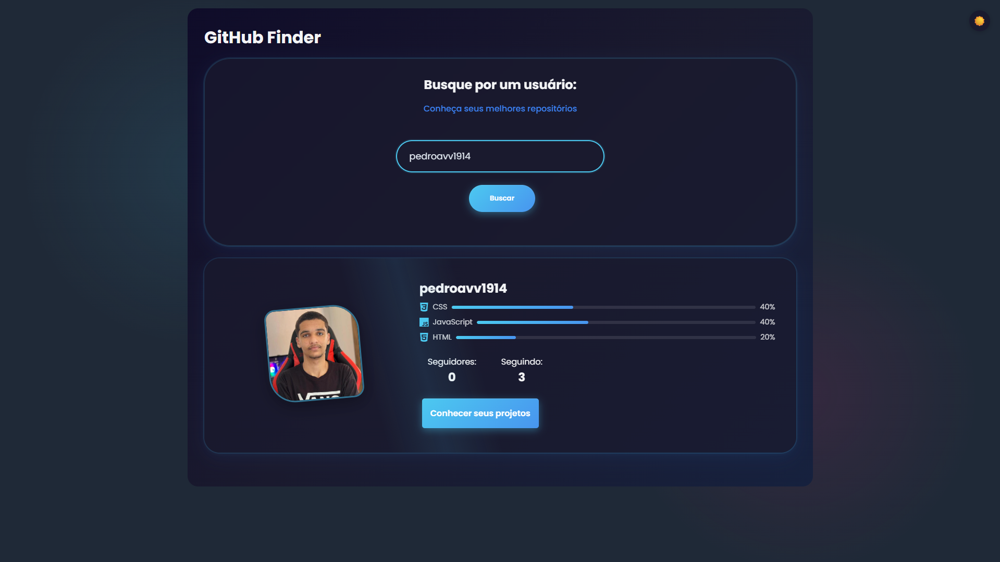

# 🔍 GitHub Finder

[](https://reactjs.org/)
[](https://www.typescriptlang.org/)
[](https://vitejs.dev/)

A modern web application for searching GitHub users and repositories with dark/light theme support.

## ✨ Features

- 🔍 Search GitHub users and repositories
- 🌓 Light/dark theme toggle
- 📱 Fully responsive design
- 🚀 Fast performance with Vite
- 📊 Detailed profile/repo information

## 🛠 Technology Stack

### Frontend
- 
- 
- 

### Tooling
- 
- 

## 🏗 Project Structure

```
github_finder/
├── src/
│   ├── components/    # Reusable components
│   ├── routes/       # Application routes
│   ├── styles/       # Global styles
│   └── ...           # Other source files
├── public/           # Static assets
└── vite.config.ts    # Build configuration
```

## 📸 Screenshots

| Light Theme | Dark Theme |
|------------|------------|
|  |  |

## ⚠️ API Rate Limits

The GitHub API has these limits:
- 60 requests/hour (unauthenticated)
- 5,000 requests/hour (with personal access token)

To increase your limit:
1. Create a [personal access token](https://github.com/settings/tokens)
2. Add to `.env` file:
   ```
   VITE_GITHUB_TOKEN=your_token_here
   ```

## 🚀 Getting Started

1. **Clone the repository**
   ```bash
   git clone https://github.com/your-username/github-finder.git
   cd github-finder
   ```

2. **Install dependencies**
   ```bash
   npm install
   ```

3. **Run development server**
   ```bash
   npm run dev
   ```

4. **Open in browser**
   ```
   http://localhost:5173
   ```

---

🔍 Developed with ❤️ by Pedro 
